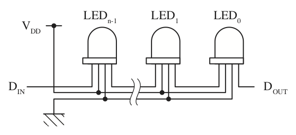
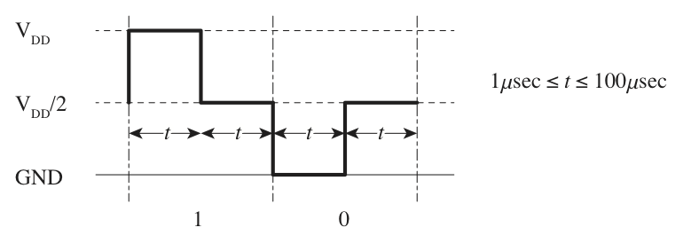
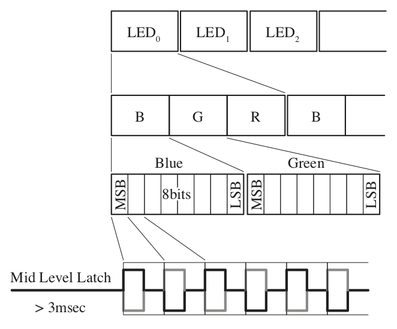
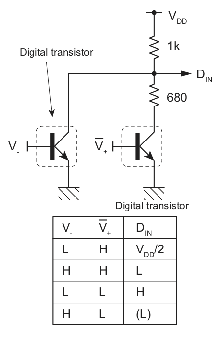
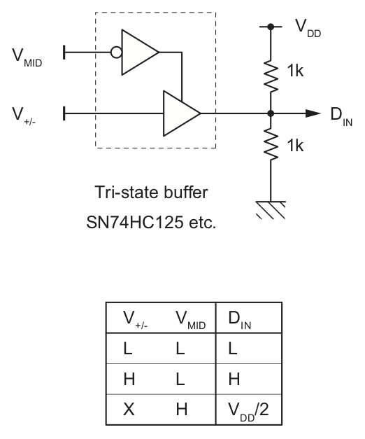
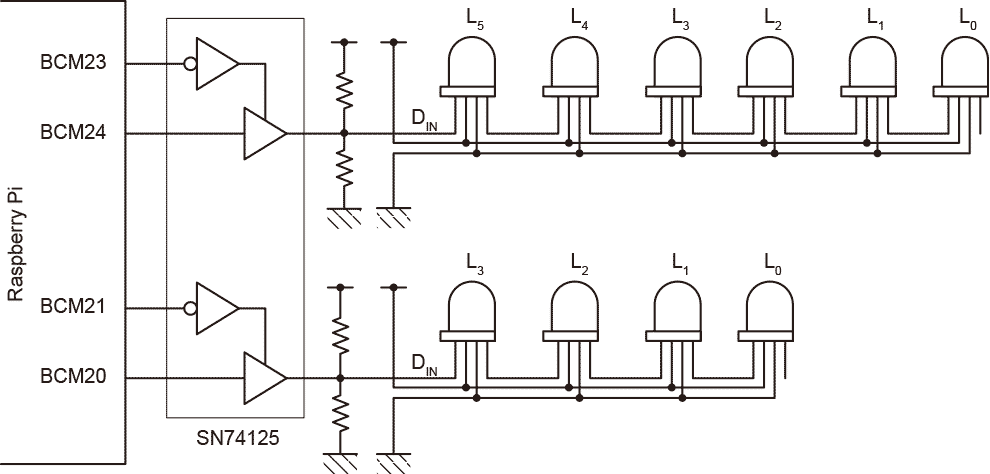
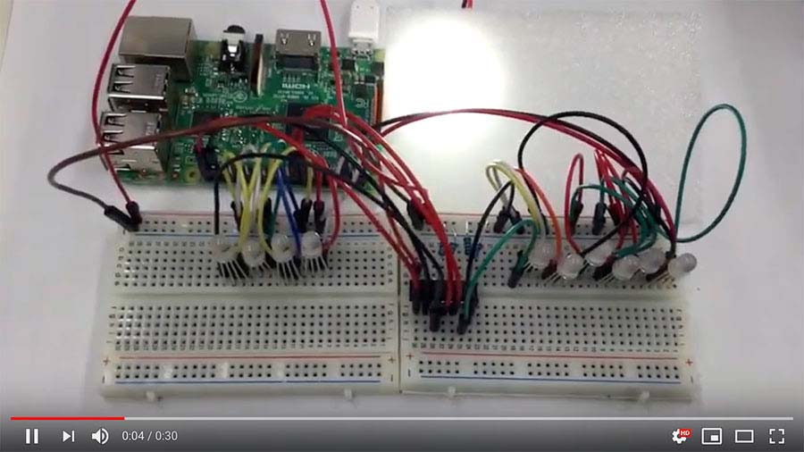

# FullColorLED controlled from Raspberry Pi

["Inteligent control RGB LED"](http://www.image.micros.com.pl/_dane_techniczne_auto/olrgb.5m600.pdf)  is tried to be driven from Raspberry Pi with pigpio library.
##LED electrical spec.

LED has 4 external pins i.e., D<sub>DD</sub>, GND, D<sub>IN</sub> and D<sub>OUT</sub>. Supply voltage D<sub>DD</sub> should be between 3.5V to 6V. It seems to be assumed 5V use. Typical current of LED is 15mA.

## LED chaining

### Pin connection

The LED can be chained in a row and cotrolled by serial data.



D<sub>OUT</sub> pin of LED can connect to D<sub>IN</sub> of next LED to pass the data sequentially.

### Serial data format

#### one bit

One data bit of the serial data is expressed by 3 voltage levels.



Their voltage tolerances are not specified in the data sheet. The middle level V<sub>DD</sub>/2 may be the basis and high and low level may be interpreted by transient from the basis.

On the other hand, holding time intervals for each level are specified between 1$\mu$sec to 100$\mu$sec.

#### serial data



8 data bits express one component byte (MSB first) of color, successive 3 components express RGB color (ordered B-G-R) of one LED and successive colors are for the rest of the LEDs on the chain.

The serial data format has no gard bits nor punctuation data. 

Time interval to latch the middle voltage level is required more than 3 msecs before starting te seirla data transfer.

#### note:

These specifications are re-constructed by the author from actual behaviours of the LEDs because the original data sheet connotes umbiguous, incomplete or inconsistent descriptions.

# How to generate three levels from GPIO

Raspberry Pi has external I/O pins called GPIO to control devices but an additional external circuit is needed to control the LED because all GPIO pins are only for binary.

It is required at least 2 pins to create 3 voltage levels. Some types of circuits and  its logics can be considered.

## Example of circuit type A



This circuit example uses two digital transistors, a transister with built-in registers and a voltage divider (Of course,  simply an ordinal transistor with registers for current limitation can be used instead). Using this circuit, the input V<sub>-</sub> should be inverted in its logic.

## Example of circuit type B



Next example is easier than A. TTL device family has tri-state buffer, e.g., SN74125, and it can be used to create the middle voltage. The tri-state buffer can control output impedance to very high, consequently the buffer output is detatched from the following voltage divider.

# Code fragments

I wrote a fragments in C to control LED chains using [pigpio library](http://abyz.me.uk/rpi/pigpio/). The library works on Raspbian operating system and has a functionality for flexible GPIO output with strict timing, i.e, waveform functions.

## color representation and its manipulation


```c
typedef struct _PFCRGBColor {
    uint8_t     r;
    uint8_t     g;
    uint8_t     b;
} PFCRGBColor;
```

`PFCRGBColor` is simple RGB color struct compatible to the LED serial format.

```c
PFCRGBColor     colorWithRGB(uint8_t r, uint8_t g, uint8_t b);
PFCRGBColor     rgbFromHSV(float hue, float sat, float val);
void            dim(PFCRGBColor *color, float ratio);
```

## GPIO pin asignment

```c
#define activeHigh  true
#define activeLow   false
typedef struct _pinSetting {
    uint8_t     pinNumber;
    bool        polarity;
} pinSetting;
```

`pinSetting` struct contains BCM pin number and its logic.

## LED chain expression

```c
typedef struct _PFCLEDChain PFCLEDChain;
```

`PFCLEDChain` is an opaque type for one chain of LEDs.

## LED chain creation

```c
PFCLEDChain     *createChainAlternativeLogic(size_t     countOfLED,
                                             pinSetting high,
                                             pinSetting low);
PFCLEDChain     *createChainTristateLogic(size_t        countOfLED,
                                          pinSetting    data,
                                          pinSetting    middle);
```

The function `createChainAlternativeLogic()` for type A circuit and `createChainTristateLogic` for type B. These two functions return same `PFCLEDChain` struct. The arguments are chain length (number of LEDs in a chain) and pin assignments.

## Color setting for each LED

Initially, just after creation, LED colors in a chain are all off (black color). Color of each LED can be set by a function bellow.

```c
bool            setLEDColorToChain(PFCLEDChain  *ledChain,
                                   size_t       indexAt,
                                   PFCRGBColor  *rgb);
```

A LED at `inidexAt` in a chain `ledChain` can be set color `rgb`.

## Convert chains to waveform array

```c
typedef struct _PFCLEDChainConverter    PFCLEDChainConverter;

PFCLEDChainConverter    *createLEDChainConverter(uint32_t       pulseWidthInUSec,
                                                 PFCLEDChain    **chains,
                                                 size_t         numberOfChains);
```

The function `createLEDChainConverter()` create a converter that converts from chains to waveform struct of the pigpio library. `pulseWidthInUSec` argument specifies holding intervals of each level of tri-state. The time interval of one bit of LED data is 2`pulseWidthInUSec` usecs (10<sup>-6</sup> sec). Second argument `chains` is array of `PFCLEDChain` and last `numberOfChains` is number of the chains in the array.

## Start to transfer data to LEDs

```c
bool                    transferColors(PFCLEDChainConverter *conv);
bool                    isNowTransfering(PFCLEDChainConverter *conv);
```

Function call `transferColors()` starts to transfer color data simultaeiously for each chain. After start to transfer, `PFCLEDChain` struct can be changed colors for the next transfer. Function `isNowTransfering()` can be used to check whether transfering or not.

# Usage of code fragments

An example code in a directory 'codeFragments'.

```
$ cd codeFragments
$ make pfcl
$ ./pfcl
```

The example code assumes Raspberry Pi with an external circuit like,



See detail in the main function in 'mainWave.c' and its operating video here.

[](https://www.youtube.com/GlYyY98fI0Q)


# Omake（おまけ）

Extra codes in the codeFragments directory for old full color LED, PL9823-F5/PL9823-F8 that employs almost the same serial chain data but different bit expression. See its [data sheet](https://cdn.instructables.com/ORIG/FW0/YN1X/IHDUL683/FW0YN1XIHDUL683.pdf).

The codes also use pigpio library and critical timing required by the LED is created via. SPI. See detail in 'mainSPI.c'.

```
$ make pfcls
$ ./pfcls
```


